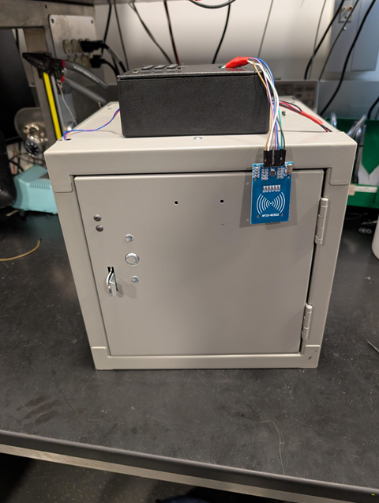
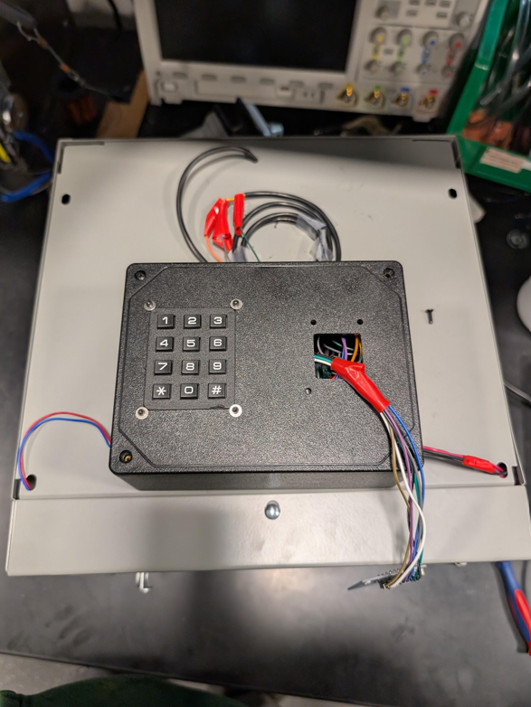
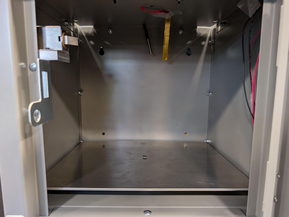

# Secure Food Delivery Dropbox

*May 8, 2025*

The goal of this project is to increase the security of food being delivered by allowing the driver to put the food in a secure locked box. The box can also keep food warm while you are on your way to get it.

### Team members:
- [Dhruva Dammanna]
- [Rohan Samudrala]
- [Taniah Napier]

---

## Results

- [Demo](https://www.youtube.com/embed/G7g3tOTm3hQ)
- [Presentation](https://courses.grainger.illinois.edu/ece445/getfile.asp?id=24668)

