# Project Log

## Week 1 - 1/20 - 1/26

This week I posted to the web board with an idea for an automatic plant watering system. It was a pretty basic idea and was told by course staff that it needed to be more complex if I wanted to pursue it. I then started brainstorming more ideas and thought of a secure mail delivery system. I will research this more next week.

## Week 2 - 1/27 - 2/2

This week I formed a group for the class and we talked for a long time about various ideas we had. One idea we are interested in is an automatic doggy door, and we might try to go down that route for our final project.

## Week 3 - 2/3 - 2/9

This week we decided to develop a secure food delivery dropbox. The idea came from the secure mail delivery project I thought of in Week 1. To make it more unique and complex, we decided on a secure food delivery dropbox instead.

Some of the specifics of the project still have to be decided, as we don't yet know how everything works. We got the project approved and are working on the proposal right now. All of us are doing every part I have been working on the control, box mechanics, and heaating mostly. Taniah and Rohan have been working on the other parts as well as helping me on these two.

I also did the CAD assignment, which helped me learn how KiCad works. I am currently working on the soldering assignment and am almost done. It has been pretty hard learning to solder.

I am still trying to learn more about KiCad though.

## Week 4 - 2/10 - 2/16

I finished the soldering assignment. We have also turned in our proposal.

To be honest, we still have to figure out some of the details, like how the actual program the user will use will work. I am leaning toward using a computer program, but I am not 100% sure yet and need to do more research.

Here is the block diagram and visual aid that we made, but some things might change — it is just an idea at this point.

We also went to the machine shop and talked with Gregg about our project. He said that he would be able to work on the project for us. We decided to use a locker as the box and they will buy the locker for us.

This week we had our first TA meeting and went over our design. It helped us get more clarity on our project's requirements and also understand the expectations of us.

Rohan ordered some of the parts this week as well that we needed.

Lastly, we wrote the Team contract with things that we would follow so that everyone can do work.

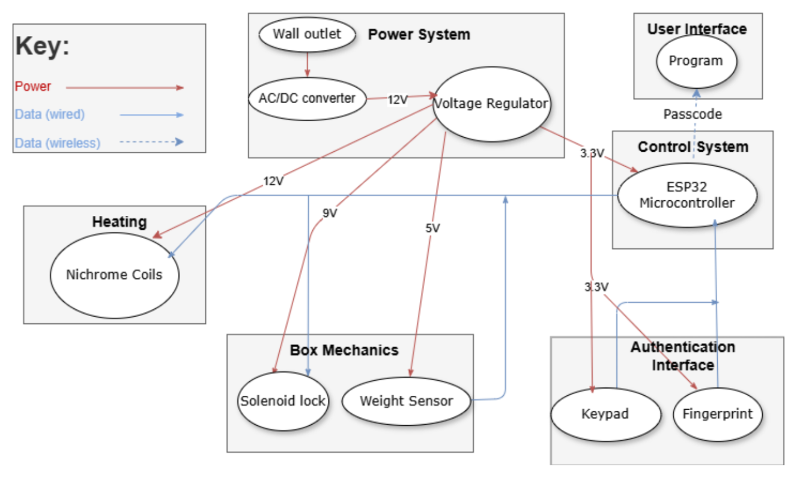

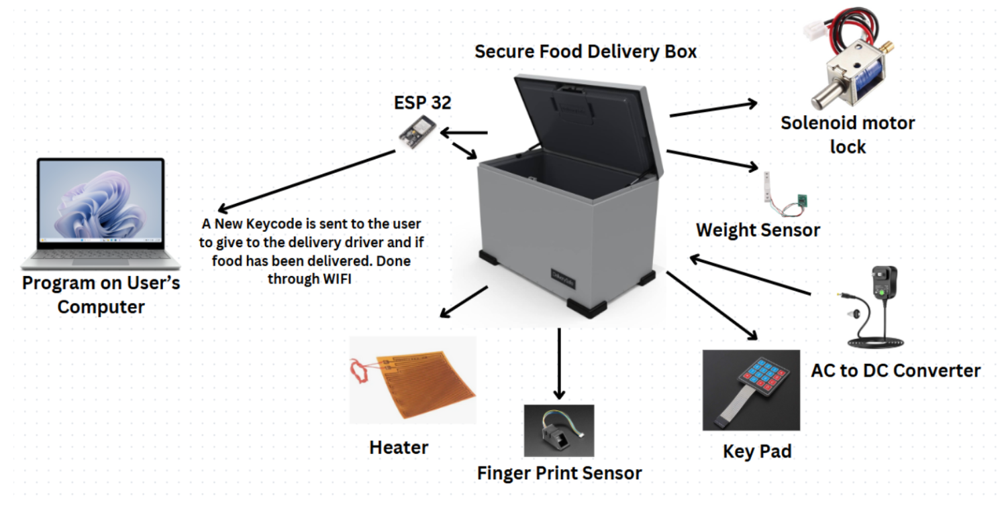

## Week 5 - 2/17 - 2/23

We presented our Proposal to our TA and Professor. During the pressentation we did not know a lot of specifics, which led to us getting questioned a lot by the professor. After the presentation we decided to go more in depth for each thing. I decdied to start building the schematic in KiCad because it helped me figure out some more design choice in a more deep level compared to a high level that we had during the presentation. One things that we might change is the fingerprint sensor as it is supposed to be used in a 2 factor authenication system, and it does not work all the time. This is more of an issue with the sensor, but we are tyring to figure out what we can change it to so we can still have 2 Factor Authenication. 

I decided to go more indepth by making the power subsystem and control subsystem schematics which u can see below. I am still not 100% sure how the schematic will be becuase it is pretty hard to understand how everything works together.

We have been thinking about the logic of the heating system right now and what we have so for is the AND 3 things that enable which can be set in the program that the user can change, a temperature to see if it is in the range of 25C - 40C, and also see if there is a weight of 50 grams or more on the sensor.

Rohan ordered some of the parts this week as well that we needed.

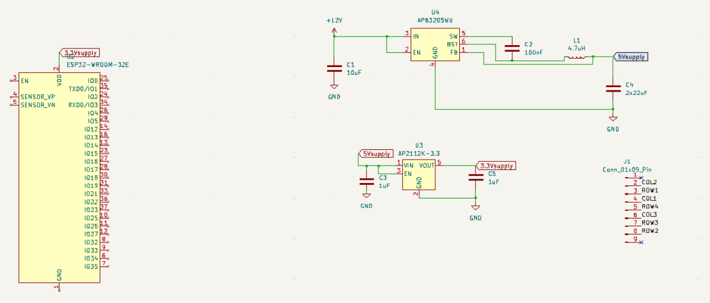

## Week 6 - 2/24 -3/2

This week was spent just working on the PCB and schematic for our first PCB order. It has been hard figuring out the circuits for each component, but we are getting it slowly. I have been doing most of the schematic and PCB deisgn. I realized the schematic to program the ESP 32 I made in week 5 was wrong and decided to complety change it, but the power cirucits I made are still write to my understanding. 

One thing I saw about our orginal design for our power subsystem was that we were dropping directly from 12V to 3.3V with and LDO. This is not good. So for this PCB i added a buck indebetween to go from 12V - 5V and then 5V - 3.3V. Too much heat will generate if I went with 12V - 3.3V here is an equation showing the power lost to heat for both situation:

Pheat = (Vin − Vout) × Iload

Plugging in our own values assuming that I load is 700mA for this case:

Pheat = (12V − 3.3V) × 700mA = 6.09 W
Pheat = (4.7V − 3.3V) × 700mA = 1.19 W

So we are generating an extra 4.9 W of power lost to heat. That can get very hot and is dangereous. So the idea I came up with the use the buck inbetween is good and I will use that.

I decided to use a usb-c to program the ESP 32 that we would have on the board. We have also decided on the exact esp 32 to use which is the ESP 32 S3 WROOM 1 N4R2 this is because it has enough program space for us and is one of the fastest esp 32's. I was debating on using a UART bridge, but I decided to use the D+ and D- lines of the ESP 32 as it will not need extra components on the board.

After I made the programming schematic we then went on the make the rest of the PCB. Which included the Box Mechanics, Heating, Authencation. Some hard things I ran into was figuring out the weight sensor's ciruit as it needs a lot of supporting components to work. We decided to use the INA125PA. Also the lock and heater cicurits are a bit confusing because a BJT or some kind of transistor needs to be used to get it to work because they use 12V and the ESP 32 outputs 3.3V. I think what we have is right but I am not 100% sure. Also in week 5 I mentioed using an AND gate on the board, but I realized we can just perform the AND in the code allowing us to not use an extra chip on the board. Rohan and I went to the PCB office hours which helped us a lot. Professor Gruev, TA Sai, and TA Chi helped us alot with our design and told us a couple things we though were right like the circuit we initally had for the load cell was wrong. After the office hours we routed the PCB, but I am kind of worried that the traces may be too thin as they are all 0.15mm wide. Which I think can cuase issues with the power, but I realzied that after I put the order in yesterday. Below is the schematic and PCB.

Our TA meeting was just a general meeting going over our design and our progress so far.

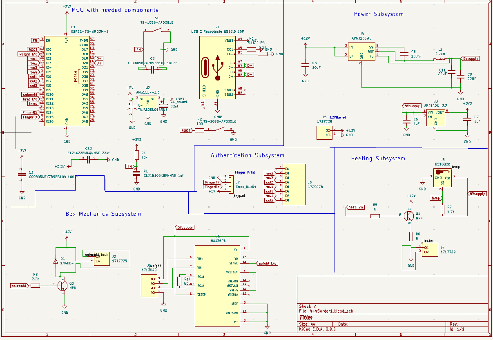
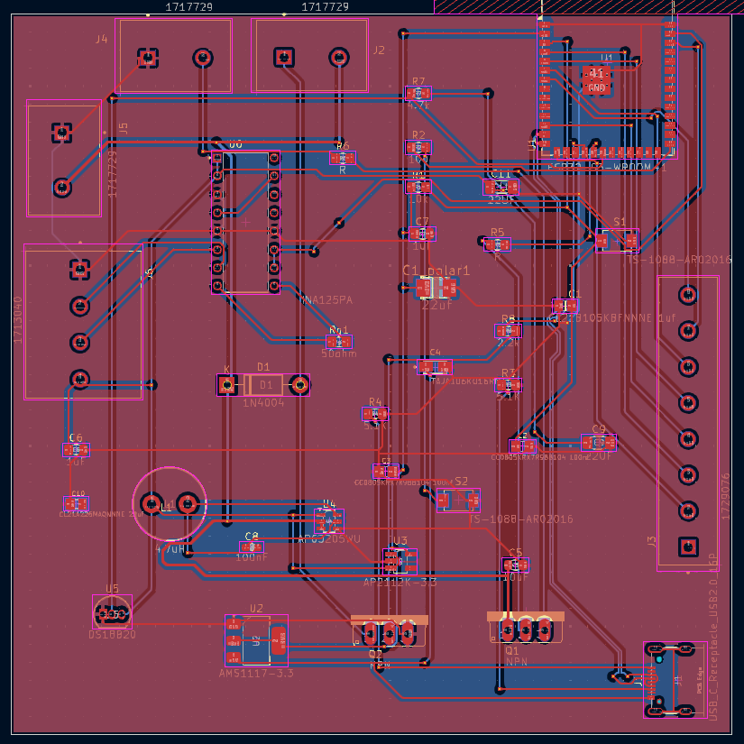

## Week 7 - 3/3 - 3/9

This week was mostly focused on testing our circuit on a breadboard. This helped a lot because it allowed us to see if what we ordered was right. After some testing on the breadboard I realized that many parts of our PCB wont work such as the heater and locks the BJT setup for both of those was wrong. One issues that we ran into this week also was that the fingerpint sensor would sometimes not recognize a correct input. We realized this after prseneting our propsal, but we did not realize it would be this innacurate, so we need to think of somethings else.

I started working on the code for the breadbaord demo also this week. I did a good chunk of it already. I also decided to change the user interface to a website instead of a comptuer program this week because it is more convinent for the user to use that over a program on a computer. I got the temprature sensor, keypad, website coded up bymyself. And then all of us met up to get the lock working as that was confusing to us. Eventually after a long debugging session we got it working. So with this I added some code into the existing code to get the lock in the code. Below is the front end of the website that I coded up. As well as a picture of the dev board used for the breadboard demo as well as some of the wiring for the demo. I found these open source libraries for the keypad and temprature sensor to use [https://github.com/adafruit/Adafruit_Keypad](https://github.com/adafruit/Adafruit_Keypad) and [https://github.com/milesburton/Arduino-Temperature-Control-Library](https://github.com/milesburton/Arduino-Temperature-Control-Library)

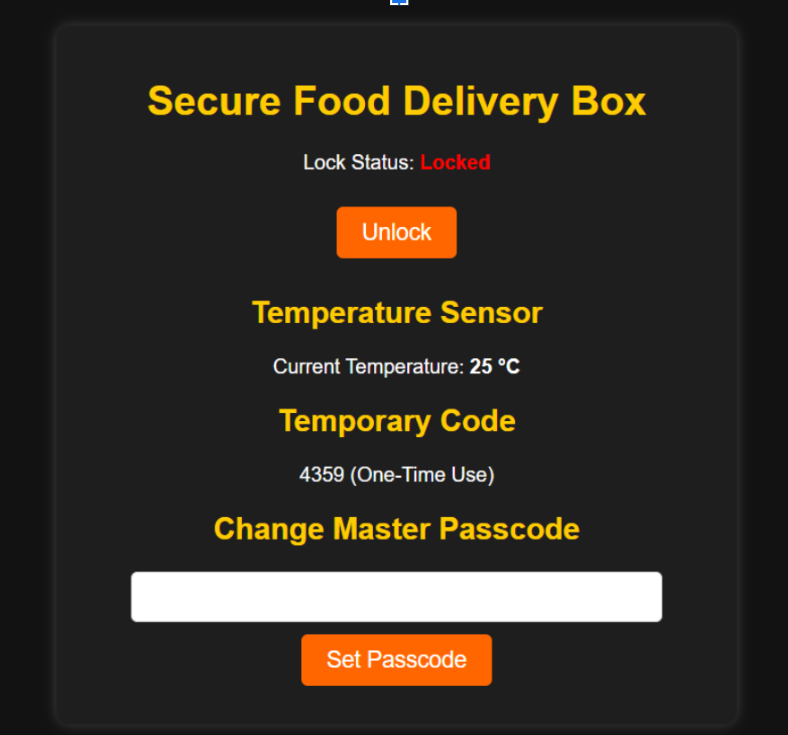
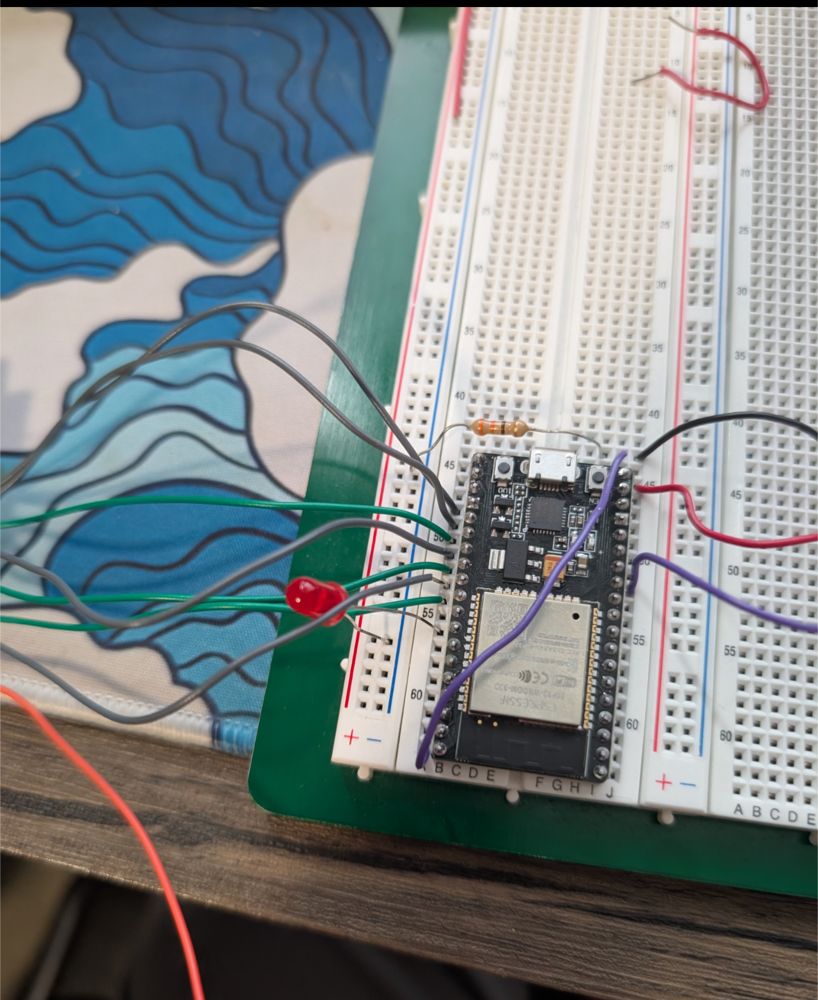

Our TA meeting was focused on what the breadboard demo will be like and what is expected of us next week during the demo. We clarified what we were going to do for the breadboard demo and our TA was ok with that.

I also did the Team Work Evaluation. The rest of the time we all worked on the design document. The design document was hard to complete because we had to make a lot of assumptions about our design without knowing if it would work or not. We split up the design doc the same way we split up the proposal. We each did parts of it, but we helped eachother when needed. We decided to use what we had so far from the breadbaord demo and make assumptions that the setup for the heater, load cell, and fingerprint sensor (Or what we choose to change with) would work the way we intended.

I am going to look into the subsystems next week that I made the assumptions about. I want to get it working on a breadboard before I make the design on a PCB.
## Week 8 - 3/10 - 3/16

This week we did the breadboard demo and it went well. We showed what we needed in the demo and we also talked about changing the fingerprint sensor to something else. The professor was ok with that so we gotta figure out what we will change that too. I am thinking about using an RFID but I have to research that more.

The biggest issue this week was that we could not get the load cell to work. We tried a bunch of different things, but we came the the conclusion that the chip we used to interface with the load cell was not right. We decided to change the chip from an INA125PA to an HX711 because there was much more information about this chip. We ordered the HX711 breakout board and HX711 chip to see if we could get the load cell to work with that. I found this library that we can use to for the HX711 [https://github.com/RobTillaart/HX711](https://github.com/RobTillaart/HX711)

This week I also did a majority of PCB order 2's design. After I finished most of the design we all met up to finalize it. I deciced to change the usb-c to a micro usb because it is easier to solder. I also added ESD protection to the micro usb so that we will not fry to board by touching it. And then based on the what we think is wrong with the load cell I decided to add the cirucit for the HX711 chip instead of the INA125PA. Below are the Schematic and PCB layout for PCB order 2. Rohan and Taniah helped a little bit in just verifying the design, but not much work was needed here.

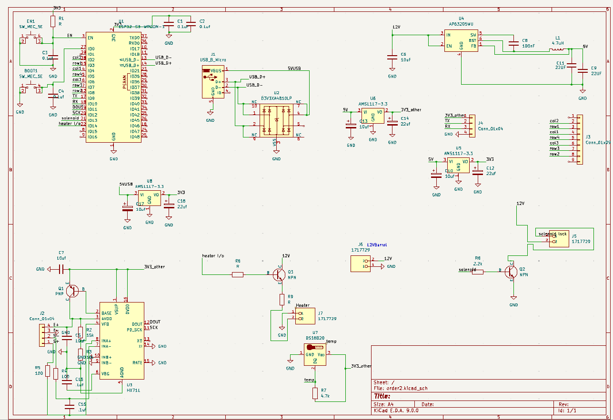
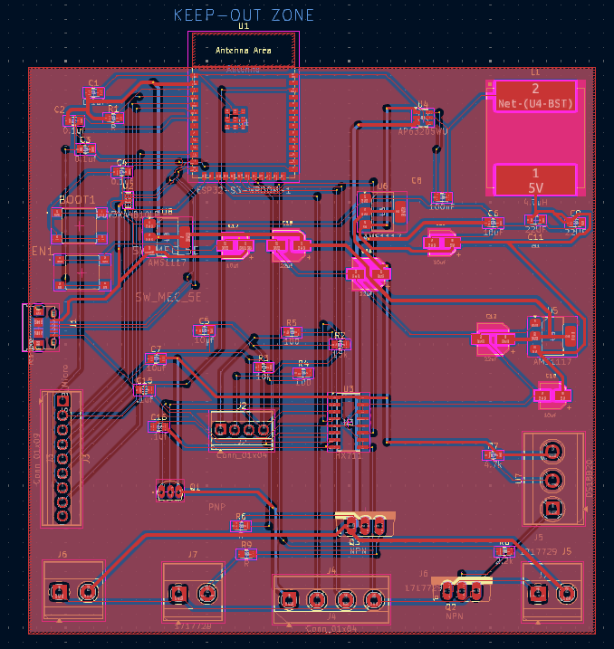

## Week 9 - 3/17 - 3/23

It is Spring Break and we did not do any work this week.

## Week 10 - 3/24 - 3/30

This week we decided to use an RFID sensor instead of a fingerpint sensor for our 2 Factor Authenication. 

During the TA meeting we talked about this and we came to the decision that this was ok to do because RFID works almost all the time and it is very rare that it would fail.

After this I tested the MCRC522 RFID Reader that we were given from our TA on a breadboard with the ESP 32 devboard. It ended up working as intended, so we were happy with the result. It took some time for me to get it working as SPI communcation can not be used with every GPIO pin of the ESP 32. I was using the wrong pin for a long time, but I eventually got it to work. I wrote code to scan for a certain UID and if that UID is scanned it will print unlocked else it will print incorrect UID. I am using this library for the MCRC522 [ https://github.com/makerspaceleiden/rfid](https://github.com/makerspaceleiden/rfid). It has everything that we need im pretty sure.

I also looked into the physical PCB we got from PCB order 1, but I realized that the usb-c we bought will not work because it will not fit the footprint. So this PCB is pretty much can not be programmed.

I also am trying to learn best practices for PCB design because I do not want to mess up PCB order 3. I have been using  [https://resources.altium.com/p/pcb-layout-guidelines](https://resources.altium.com/p/pcb-layout-guidelines) to figure out how to lay the PCB out. I think that is the biggest issue I have right now because with the other 2 PCB orders I just put everything all over the place and did not consider putting things close to eachoter. Things like Capacitors can not function like they should if you do this.

## Week 11 - 3/31 - 4/6

I have finshed PCB order 3 pretty much by myself. I decided to make a lot of changes here compared to the last PCB's. I changed from using micor usb to program to a USB-UART bridge. We have bought the bridge. It is called the [ESP PROG](https://docs.espressif.com/projects/esp-iot-solution/en/latest/hw-reference/ESP-Prog_guide.html). It is a UART bridge made for the ESP 32 so it makes it easier to program. I have also laid everything out as close as possible following the layout rules I read in the link from week 10. I have also made a PCB design that uses an ESP 32 S3 devboard just incase the other design I made does not work. Hopefully I do not have to use it, it is just a back up plan. I did also make one of the copper pours 3.3V and the other GND, but I do not know if it is 100% ok with this design, but I have seen other designs use this so I did. It also is easier to route because no GND or 3V3 traces are needed.

Then as a group we then tested the power subsystem of PCB order 2. We soldered the [AMS-11173.3](https://mm.digikey.com/Volume0/opasdata/d220001/medias/docus/5011/AMS1117.pdf) on the PCB with its decoupling capacitors. We then used the lab power supply to put 5V into the Vin pin. Then we used the multimeter to measure the voltage coming out of the Vout pin, but for some reason it was 2.7V. I am not sure what is causing this, but this by itself is enough to make the power subsystem not work at all. Im thinking it is the capacaitors but not 100% sure.

The TA meeting this week was just to go over the IPR and the design that we made for PCB order 3. Our TA was hesitant on if the 3.3V copper pour would work in our PCB 3, but we already ordered it. We also showed our TA the output of 2.7V, he was not too sure why its doing that.

After this we tested the nichrome heater and got the cirucit for it down. Below are all of the Schematics and PCBs for order 3:

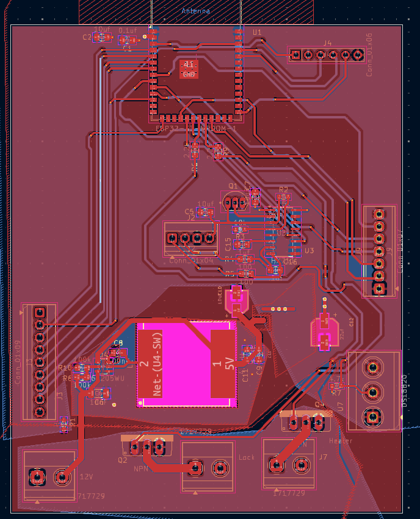
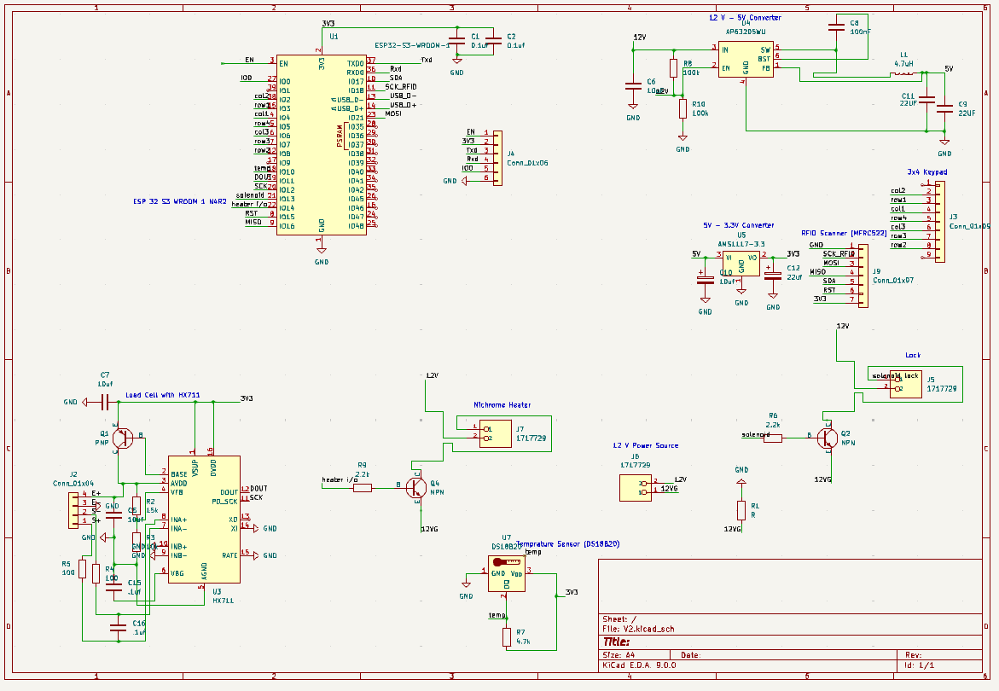
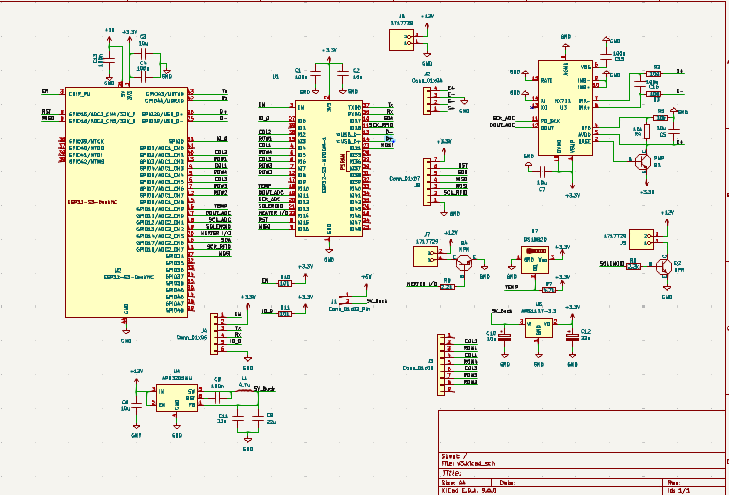
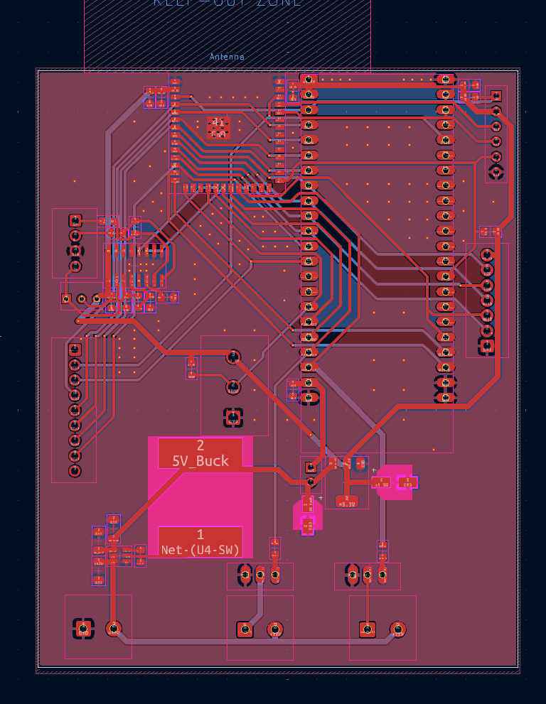

I thought of an idea to just use breakout board for the power subsystem if we can not get it to work on our own PCB. Because a power subsystem that does work means nothing works because nothing gets power.

We all went to office hours and talked with our TA about using breakout boards and he said that it was a good idea, so for PCB order 4 I will implement that

## Week 12 - 4/7 - 4/13

So PCB order 4 is due this week. I decided to go through with using breakout boards. I made 2 breakout boards with my team one for a 12V - 4.7V 3A DC-DC Buck converter and one 4.7V-3.3V 800mA LDO. I then made a PCB by myself using the ESP 32 S3 module with the breakout boards and then one by myself with a ESP 32 S3 Devboard. I am pretty sure the ESP 32 S3 module one will work I spent hours going through the design and researching and this fits everything I saw. I just ordered the devboard one just incase, but I do not think I will need it. Below is the PCB and Schematic for the ESP 32 Module PCB I made. 

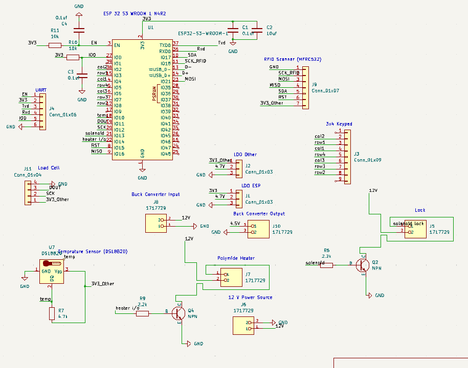
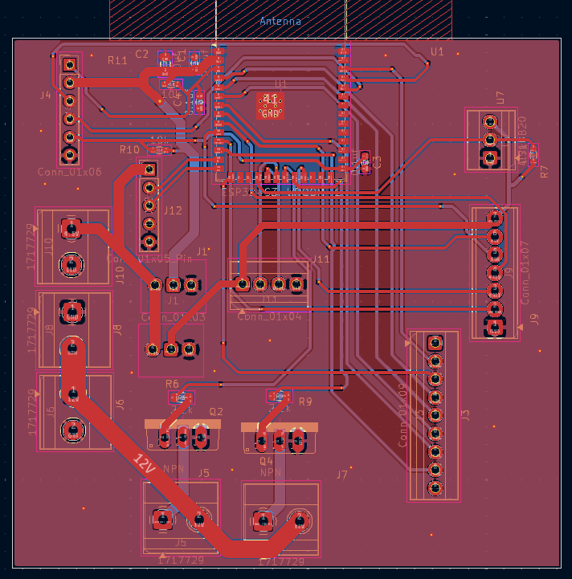

Because the AMS 1117 3.3 has 800mA max I made the decision to have 2 of them on the PCB one for the ESP and one for everything else using 3.3V. This also allows the noise from other 3.3V things to not impact the ESP 32 wifi. Below is a graph from the AMS 1117 data sheet showing the max current is 800mA and the ripple detection gets worse the more current being drawn. 

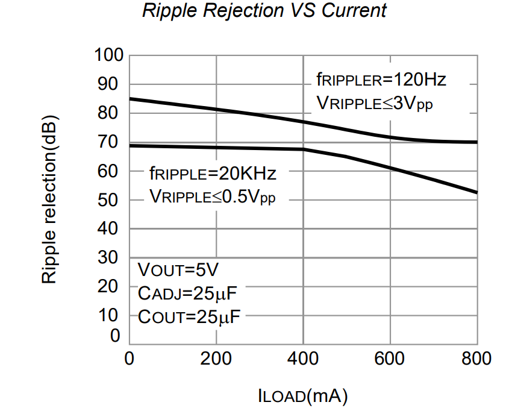

This design also is a lot more simple than the other ones that I made. The reason I did this is to make the soldering easier and also less areas for errors. Hopefully these design choice lead to that.

We had our TA meeting after the orders went through and I showed our TA the PCB's ordered and he said they looked good. Now we are just waiting for them.

## Week 13 - 4/14 - 4/20

We eneded up getting PCB order 3. I was looking through PCB order 3's design and realized that I can acutally program it using the ESP PROG and the breakout boards we bought for the [LM2596](https://www.amazon.com/Seloky-Adjustable-Step-Down-Converter-Voltmeter/dp/B0DM946DHG?source=ps-sl-shoppingads-lpcontext&ref_=fplfs&psc=1&smid=A2E1XB0KAFTH8V&gQT=2) and [AMS1117-3.3V](https://www.amazon.com/Anmbest-AMS1117-3-3-4-75V-12V-Voltage-Regulator/dp/B07CP4P5XJ?source=ps-sl-shoppingads-lpcontext&ref_=fplfs&psc=1&smid=A323VFV6W4CN1S&gQT=2) to power the system. 

As a group we then used the oven to solder the ESP 32 onto the PCB. It thankfully worked first try. I was worried it would not work, but it did. I then soldered the wires from the breakout boards to the correspoinding pads on the PCB even though this looked bad it electricaly should work.

The next day I came back and saw that the solder came undone some how so I soldered it again and made sure to get a good connection this time. Then as a group we soldered the programming headers and then plugged in the DC barrel jack and the ESP PROG GND, TX, RX, IO0, and EN pins to the headers. Then I put the ESP into download mode by holding IO0 pressing EN then letting go of IO0 while uploading the code to the ESP 32 in Arduino. Then the program was uplodaded. Thankfully it worked first try. Something I did not expect.

In a couple days now I am going to try to get our breadboard demo onto our PCB 3. The goal is to get PCB 4 working because it looks a lot more clean and was made for the breakout board. This is just a back up because order 4 is stuck in customs right now.

During the TA meeting we just went over our current progress and what we have left in the project. We still have to figure out the load cell everything else works fine.

I just completed the Team Contract Assesment also. Not much was done in terms of design this week.

My team and I met up again to get the breadbaord demo onto PCB 3. We ended up getting that to work. All we had to do was just upload the code. Next week I am aiming to get the entire project working on order 3 if we do not get order 4 in time.

## Week 14 - 4/21 - 4/27

We presented the breadboard demo working on our PCB 3 for the Mock Demo. A lot of work still has to be done for the Final Demo. 

Togther as a team we tried to get the Load Cell to work the with the HX711. After a long debugging session we got it to work and calibrated it properly to detect a weight of 40 grams or more. This is the last subsystem we had to test. In theory everything should work. Also this same day I decided we should ditch using the nichrome heater as it is a exposed wire that can heat to 400 degrees celsius. This is very dangerous, so I decided to use a polymide heater instead. The wiring is the exact same between the two, so no changes need to be made to the PCB. They are both just resistors that get hot that is all. The polymide heater does not expose the actual wire making it much safer.

PCB 4 finally came in a couple of days after the load cell started working. As soon as we got PCB 4 I soldered it with the help of my team. We used the oven to solder all the SMD components which are the ESP 32, Resistors, and Capacitors. Then I soldered all the through hole which are the pin headers, screw terminals, AMS breakout boards, and bjts [TIP120](https://www.onsemi.com/pdf/datasheet/tip120-d.pdf). Then we programmed the breadboard demo onto PCB 4 and it worked. We have to get the entire program working now on the PCB.

Now its the next day we got most of the program to work the way we intended to. Everything works, expect for the RFID sensor and the keypad for some reason. We have to meet again tomorrow because the final demo is coming up and we are on the first day.

So we all worked together and figured out the issue with the keypad, it is that we are not allowing enough time for the software deboucing in the code to allow for the key presses to be read properly. So before adding enough time all presses were not being read now all presses are being read. We also just solved the problem with the RFID. It is that the RFID emmits EMI waves to be able to read RFID tags. The issue is that our RFID reader is sitting ontop of the PCB which causes problems. To fix this all we did was move the RFID away from the PCB and it started working. Everything is now working as it should for the final demo which is good. We also went over how exactly to do the final demo. Below is our final PCB

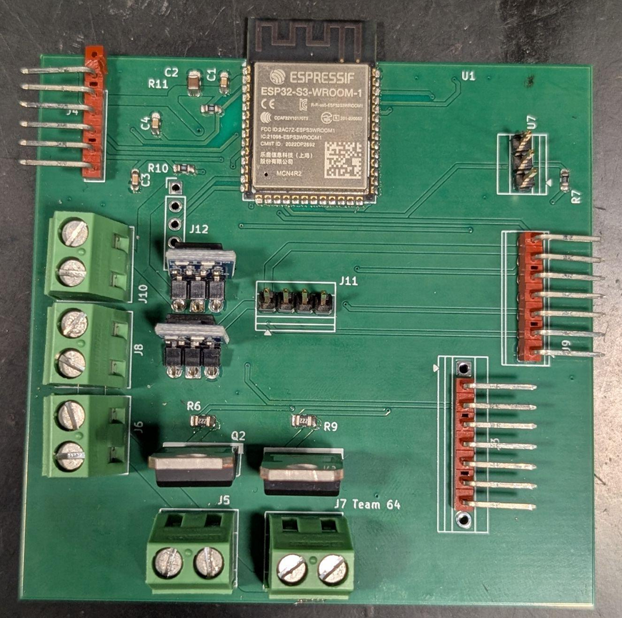

To make sure that the heating and load cell were working as intended we run 1 test for each. For the heater we checked that it turns off when it is 32 degrees C or more and for the load cell we tested the weights it can identify and how long it takes to. Below are graphs of the results of these tests.
    
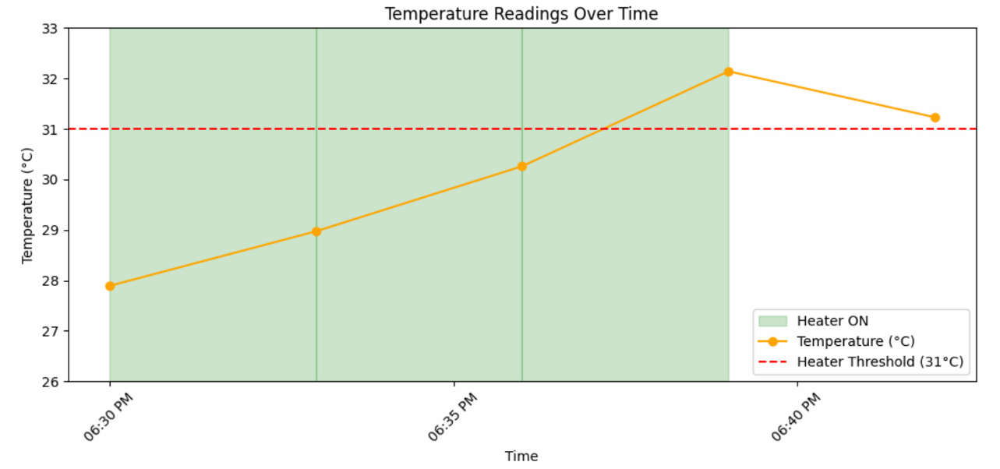
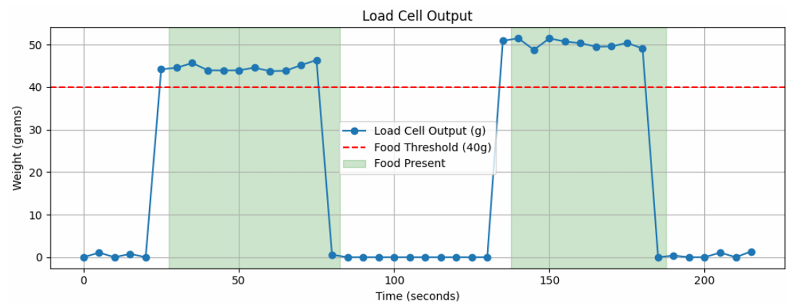

These results fit what we expected. Several other tests were ran on the RFID, keypad, lock, and temprature sensor using print statements to the serial monitor. All results were what we expected.

The final wesbite that we made is below:

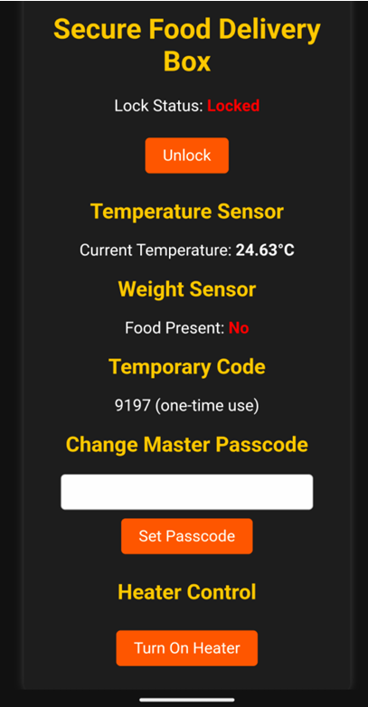

Here is the flow chart (Pseudocode) of the logic for the final demo, we used this as a base to write the code:

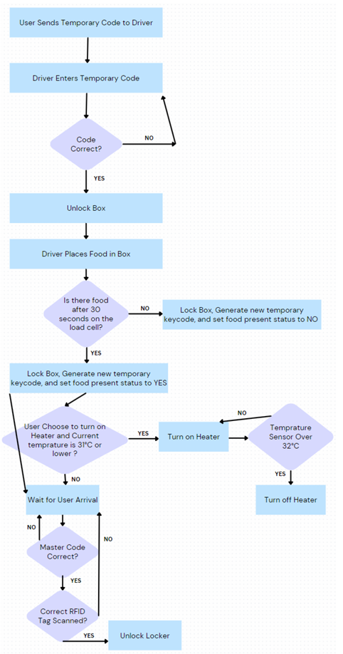

The physical box will be in the front page README

We all know what to do for the final demo and are all ready for the final demo.

## Week 15 - 4/28 - 5/4

Here is the final block diagram that we made before the final demo. It reflects 100% of what we ended up demoing. All of us worked on this block diagram.

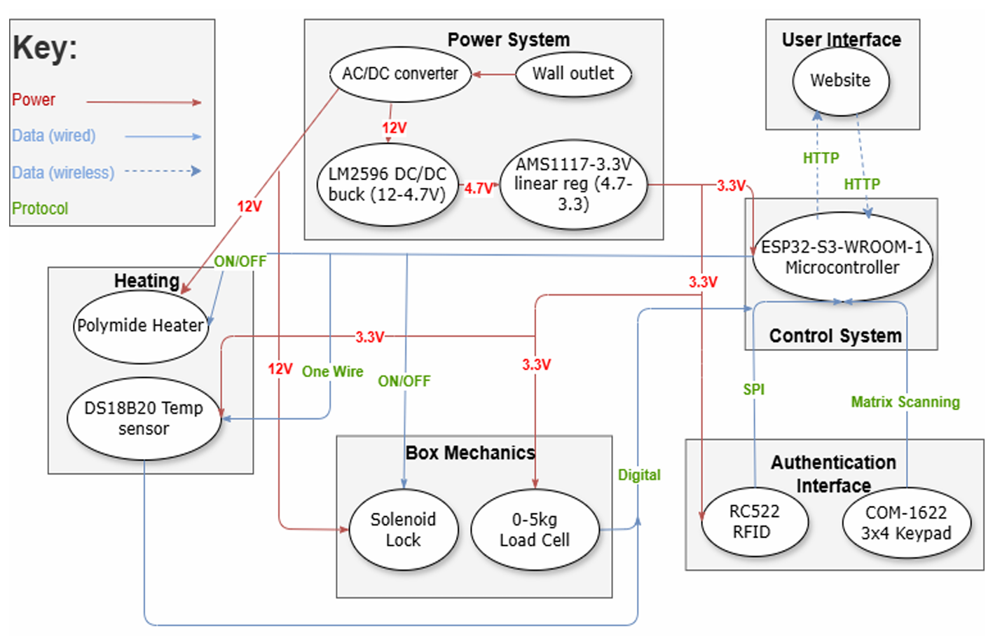

We presenseted our final demo and it went well. Everything worked as it should have. One thing I wish I could have changed though was the RFID sensor hanging as it made it look a little worse, but with the setup we had we had no other choice. Now we have to create our presentation and do the mock presentation.

2 days later and we are now working on the presentation. It was not that hard because we already made the entire PCB. We just split up the slides where I did the control subsystem, Authentication Subsystem, Original Design vs Final Design, and Conclusion. Rohan did the Heating, box mechanincs, Requiremnts and Verification. Taniah did the Power, intro, and user interface. The same day we recorded our extra credit video. 

The next day we had the mock presentation. We presented what we had so far and the feedback we got was to make more eye contact, include a short video, and to add graphs to our presentation. We will make these changes before the final presentation.

## Week 16 - 5/5 - 5/8

First thing we did this week was pressent our presentation. It went well, I feel like we could have talked about the tolerance for the power subsystem more though. Not many questions were asked after the presentation. Aside from that it went well. 

The day after the presentation we started working on the final paper. The final paper seems pretty long, but it is just getting eveything we did together pretty much. We split up the paper, I worked on the Control Subsystem, Power Subsystem, User Interface Subsystem, Physical Box Design, and helped in various other areas as well. Taniah worked on the conclusion, formatting, scheduele, and introduction. Rohan worked on the Authenticaon subsystem, Heating subsystem, and Box mechanics sections.

On 5/7 we finished the final paper and turned it in. Pretty much done with this class now. Enjoyed it and enjoyed building our project the secure food delivery drop box.

Just finished up the Lab Checkout. Returned everything.
