# ece445 notebook

## 1-22-2025: Brainstorming pt 1 - Discussing prelim ideas

Click to expand

Our group has been formed. 

My ideas: 
-	Shazam for movies and tv quotes: You remember a quote from a movie or show and don’t remember which movie or show. 
-	A head accessory that tells you when you’re approaching someone, or someone is approaching you. Good for walking at night and being aware of your surroundings or just for walking while looking at your phone.

Rohan’s idea:
-	automatic doggy door that opens with rfid tag.

Dhruva’s idea
-	automatic plant watering and monitoring system 
We decided that might idea might not be complex enough, but that Rohan’s and Dhruva’s ideas are worth a try so both of them will put their ideas on the web boards, then we will choose 1.

## 1-27-2025: Brainstorming pt 2 - After web board feedback

Click to expand

After a little bit of feedback on both Rohan’s and Dhruva’s idea posts, we found that Dhruva’s idea might be too close to past projects. So we are going to meet after lecture tomorrow to either discuss other ideas or start fleshing out the doggy door idea.

## 1-28-2025: Brainstorming pt 3 - Decided on a project idea

Click to expand

We decided to go with the doggy door for our RFA and decided it would include features such as, outside temperature consideration, time of day consideration, and user application to set the time and temperature conditions. 

## 2-2-2025: Brainstorming pt 4 - Sumbitting 1st RFA

Click to expand

We finished and submitted the RFA.  [(link original RFA)](https://courses.grainger.illinois.edu/ece445/pace/view-topic.asp?id=77449)

## 2-3-2025: Brainstorming pt 5 - RFA rejected

Click to expand

We received a comment on our RFA that our idea already exists, and we would need to significantly change our idea. We have decided to meet tomorrow to either come up with a way to make our current idea different or think of more ideas and hopefully submit another RFA.

## 2-4-2025: Brainstorming pt 6 - Sumbitting 2nd RFA w/ new idea

Click to expand

We came up with 3 ideas after brainstorming:
1.	A secure package container to prevent theft. It would include a weight sensor, such that when the weight of a package was detected the box would lock so no one else could take it. Only the user had the ability to open it (passcode or RFID tag).
2.	 A Lego sorter and or dispenser: The sorter would separate Legos by color and size and the dispenser would take some type of input of the type and color of the block desired and output it to the user. The sorter would first orient the pieces so that they are separated then it be put on a conveyor with varying sized holes going from smaller to larger such that the pieces were sorted by size, then using a RGB sensor the pieces would be further sorted into colors.
3.	A glove that can read braille, decode it, then tell the user what letter or number it is. A glove with sensors on it that would read the braille bumps send the data to some code that would decode the letter or number, then have a speaker output the letter or number.

After talking with a TA, we decided that the Lego and glove ideas were too complicated for us to attempt in one semester, but the package container idea was not really needed since mail carriers already have something similar. So, we adapting the secure package idea to instead be a food delivery Dropbox, since we figured there isn’t really a reliable solution to food from doordash or uber eats being stolen, and its more topical for college students.

New idea: secure food Dropbox. The box would always be locked but a randomly generated passcode would be told to the user who could then text it to the delivery person to open the box. Once the food was placed in the box and detected by weight sensors, the box would lock again and the previous passcode would not work and a new random code would be generated, so that the delivery person couldn’t open the box again. Then the user would use a separate master code that could always open the box to open it and retrieve the food. Since this is a food box, we want to also include some type of insulation to keep the food warm and drinks cold.

We talked with the professor and got verbal approval to turn this idea into a RFA. We finished the RFA then submitted it. ([link to new RFA](https://courses.grainger.illinois.edu/ece445/pace/view-topic.asp?id=77449)).

## 2-5-2025: Project approved

Click to expand

Our RFA was approved, but we got a comment that 
- "Dual authentication should be required over the existing locking mechanism, maybe a fingerprint. Also, add a heater inside with a closed-loop system to keep the food warm." - Sainath Barbhai (admin)

I looked at some other projects from this semester that saw that Self Temperature and Taste Regulating Tea Cup ([link to their project](https://courses.grainger.illinois.edu/ece445/pace/view-topic.asp?id=77454)) from Anirudh Kumar, James Li, and Lahiru Periyannan will use thermoelectric peltier module to heat their tea, and  I looked up that it is effective at cooling as well so I'll talk to my team about this for our project.

## 2-11-2025: 1st TA meeting and working on the proposal

Click to expand

Today we met at 2pm to start working ou out proposal and talk through more logistics of the project such as how each subsystem might interact with each other.

We met with out TA and talked about our proposal. We learned that we need to redo out high level requirements to be more about the accuracy and responce time of the whole project. 

For our heating system we were told that we need to have some type of logic component can't cant just stick a heater in the box and call it done. Our TA gave us the idea to use a temperature sesnor to survey the environement of the box then use some logic to repsond to the temperature sensor. For example, if the temperature sensor reads too low, heat up the environement.

## 2-12-2025: Meeting to work on proposal

Click to expand

Today we met at 3pm to continue our proposal. Our new high level level requirements for our project are as follows:

- Authentication inputs should be recognized and should unlock the box at least 12 times out of 15.
- The box should recognize an object of at least 50 grams inside of it at least 12 times out of 15 and will lock approximately 20 seconds or less after the food has been placed inside and the box has been closed.
- The box should generate and send a new passcode to the user within 1 minute after last use and the user must receive this new passcode within 5 minutes 12 times out of 15.

We ironed out some more of the logistics of the subsystem.
 - For our locking mechanism we are thinking of having 2 servos on either side of a horizontal deadbolt lock. When a signal is recived to initiate locking, the servo in charge of locking the the box will push the deadbolt into a place, and when a signal is received to unlock the box, the other servo will push the deadbolt back out of the locking slot.
 - We talked about various battery voltages that we may need. The keypad we initially intended on using takes 12 volts but we deviced to use a 9 volt battery, so we decided to try and find a keypad that takes 9 volts.
 - We are still unsure what to do for heating. We dont know if it's feasible to just put a heater in out box and use a temperature sensor and logic to determin when to turn on and off the heater. 

 Plans for next meeting on 2-12-2025 at 2:
 - meet with e-shop and get advice on our locking system and out idea for heating. Maybe they have a way of heating that they have used in previous semsters that will fit our design.
 - Finsh our proposal
 - Work on our team contract  

## 2-13-2025: 1st E-Shop meeting and finishing the proposal
- includes tentitive parts w/ explanations+datasheets+listings and block diagram

Click to expand

We stated by going over what we though the contruction of our box would be like and where all the components would be located so that we would have something to show the E-shop. We came up with the picture below. 
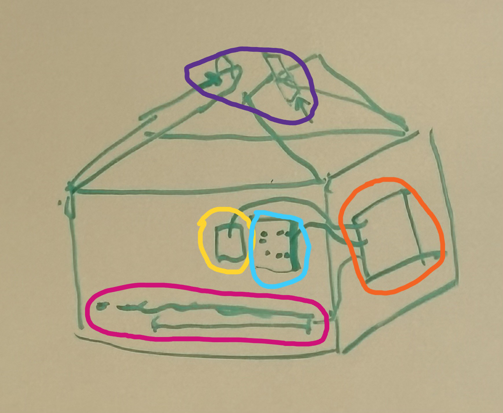
We though that we would have a box that opens up and out with different sections.

- Orange section: The microcontroller would be on the outside wall of the box and would have connections both inside and outside the box on the side.
- Blue section: The keypad would be on the outside of the box on the front facing side of the box.
- Yellow section: The fingerprint pad would be on the outside of the box on the front facing side of the box.
- Purple section: The top of thd box were the box opens would have a deadbolt lock on the inside with a latch on the other side of the opening. We intended for there to be a server motor that would move the deadbolt in and out of the latch to lock and unlock the box. 
- Pink section: There would be a false bottom with where food would sit. The weight sensor and heating would be on the actual bottom of the box. 

Then we went to the E-shop with picture and idea of what would make up the box and became the 25th group in their queue. There were a couple changes that we made based on the suggestions from Gregg. 

Changes and other considerations:
- Box opening: He said that it would be easier for them to make the box from a locker that opens from right to left insead of up. He said he would mostly buy and use a locker similar to the one shown below.

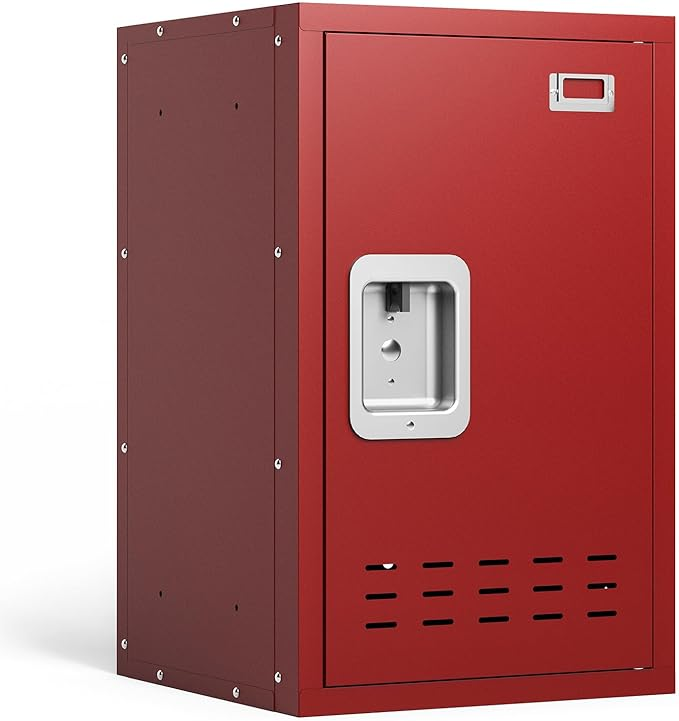

| Datasheet| Listing | Video |
| ------ | ------ | ------ |
|        |[link amazon listing](https://www.amazon.com/KAER-Lockers-Lockable-Organizer-Playroom/dp/B0DFLMMLZN/ref=sr_1_3_sspa?dib=eyJ2IjoiMSJ9.aPxAtUagz8dRhgH86AdDTPeIHD5g8WG_KprhZudOY0yvL3RTZIs5U7lULeauJlP7uYIfeyDKOG4xz13SKB7eoKCVPlWZuuhAZiH787lQbXIvzGce4nsJM-I0kqwZq_37CYElQKg1tcgyzwrotgaX_jYGhl-C3CY1TNPceIbCiNRuECKBA6Eqa0LMJE0OCq3sOtc9tKqA4iCoOwKZFnMDK2SOKql0pEoqJMafFjzMi2bE-uhxhsbPhOo07udlkehJ-xjdepnDwG5eQeuU2Hwb2hTqnhI9pHx2YvZosbX7rxY.Y995hSF4Mb1XXMZ6vuojUDnAyuuKYZInoLqLZXpinKs&dib_tag=se&keywords=small%2Blocker&qid=1739483365&sr=8-3-spons&sp_csd=d2lkZ2V0TmFtZT1zcF9hdGY&th=1)       |       |
- Locks: We origincaly intended to use a servo motor to lock our box. Gregg said that although that was a feasible option a solenoid lock would be be simpler to use. So we intend to use thoes instead. Gregg also be cafefull to buy a lock that is big enough for the shop to work with. The lock we chose as well as an explanation of how they work will be included in the tentintive parts section below.

- Weight sensor vs Button: Gregg suggested that we could instead use a simple button that would be pressed when food was placed inside the box, however we thought that we would need the completely of using a weight sensor, so decided to stick with a weight senosr. After deciding on the weight sensor instead of a button, he told us we should be careful with the weight rating of the weight sensor we buy. We should buy a senosr that is rated slighlty higher to the weight we plan to test and demo with. The weight sensor we chose as well as an explanation of how they work will be included in the tentintive parts section below.

- Plug in vs Battery: When we told Gregg that we wanted to add heating, he said we would need to change to using outlet current since heating would need more power that what we were planning with our battery. So we decided to go with plugging into outlets istead of a battery. We will buy a AC/DC power converter that will be included in the tentintive parts section below.

With these new chages we  continued to work on our proposal and iron out our understanding of how our project will work.
- Solution to heating: We decided to use Nichrome wires between our false bottom and actual bottom. The wires we chose as well as an explanation of how they work will be included in the tentintive parts section below.

- Choosing microcontroller: We chose to use the ESP32 microcontroller since it has wifi capabilities that we can use to send notification of food arriving to the user.  [Link to microcontroller datasheet](https://www.espressif.com/sites/default/files/documentation/esp32_datasheet_en.pdf)

We finished our proposal and were able to create a block diagram (shown below) and a tentitive list of components we will use/ buy. 

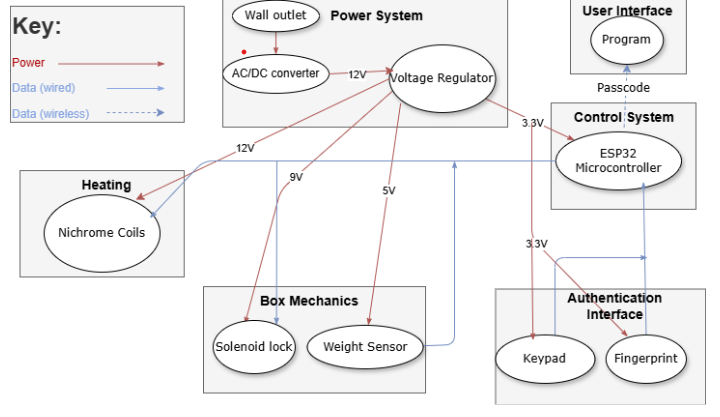
 
Picture of our block diagram

**Tentintive parts with some explanations** 

- Keypad
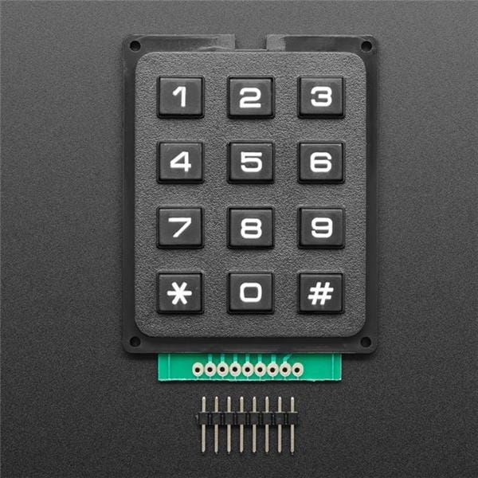

| Datasheet| Listing | Video |
| ------ | ------ | ------ |
|[link](https://www.mouser.com/datasheet/2/737/Adafruit_3845_Web-3357717.pdf)       |[link](https://www.electromaker.io/shop/product/3x4-matrix-keypad)       |[link](https://www.youtube.com/watch?v=9HQjpNSX9HE&t=355s)       |

- Fingerprint
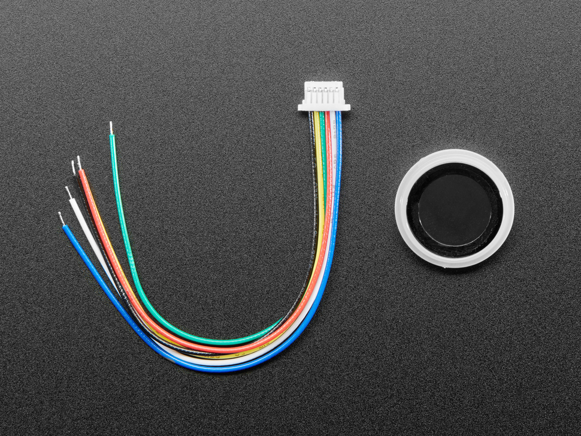

| Datasheet| Listing | Video |
| ------ | ------ | ------ |
|[link](https://www.mouser.com/datasheet/2/737/adafruit_optical_fingerprint_sensor-3364191.pdf)        |[link](https://www.electromaker.io/shop/product/3x4-matrix-keypad)       |[link](https://www.youtube.com/watch?v=HXIlXRVhcjM&t=116s)       |

- Solenoid lock
    - In non technical terms, an electromagnetic field is produced when current runs through a solenoid. The pull of the electromagnetic field will will pull any magnetic plate firmly towards it. This firm joint will be our lock. When the current is turned off the field will disapear and our lock will unlock. [How solenoid locks work](https://www.nimblefreelancer.com/solenoid-door-lock-mechanism/#What_is_the_Solenoid_Door_Lock_Mechanism)
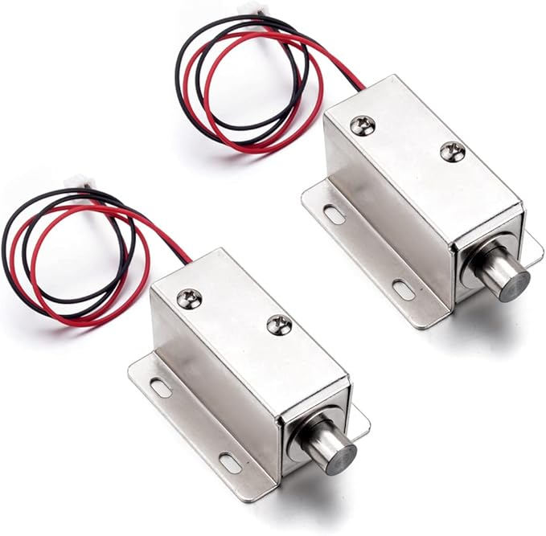

| Datasheet| Listing | Video |
| ------ | ------ | ------ |
|[link](https://www.farnell.com/datasheets/2865757.pdf)       |[link](https://www.amazon.com/Atoplee-Drawer-Electric-Assembly-Solenoid/dp/B01N650528?crid=3GUAKT8BFNCIX&dib=eyJ2IjoiMSJ9.ZX_mgTZbrW9E5219xVXV1WCSM1fI1kpi4dtYc-b9DzX-Fhh0KspqWA7R6_9Xy-PUkmyQfzivOQiEXYhwNnEM-My9yaIuaZ9e_riDDB6AHTrdVVFsDBin-SS56vU8q-2QJpASb5t0ZFav61xb10V7UuWtsVmC_BTFYXzUHGNcLjuTtpXi9Kz0zskxWWIw2zbVe2JmsK30tEGURtbuw2iuD40aS6-T5a4aTDBCIy4MMiM3KVZimt8xKYY9xbQfbpdewt48iLZuNUYrt9aP8ttfmCehy3AlENdgsLrJ_MGgsDfRgLJaYqiF-JOcv9dkeEt_x60RPUkjFmzmzPh0HGuQ5YtQBf4Z62yRpG758Kw0yYE.WRiVX4kA9W2eBF2si5yIIqeTOFHXtynDgGYAG9i8pDk&dib_tag=se&keywords=Solenoid%2BLock&qid=1739482582&s=hi&sprefix=solenoid%2Block%2Ctools%2C203&sr=1-11&th=1)       |[link](https://www.bing.com/videos/riverview/relatedvideo?q=toplee+2pcs+electromagnetic+solenoid+lock%2cdc+12v+0.8a+door+drawer+tongue+down+slim+design+assembly+magnetic+lock+datasheet&mid=36DE50CF3A298B51E07036DE50CF3A298B51E070&FORM=VIRE)       |

- Weight sensor
    - In not technical terms, when you place something on a weight sensor, the strain gauge inside the sensor does down and bends a little then the resistance caused by the bending of the gauge is measured and turned into an electrical signal that is then converted and outputed as a weight. [How weight sensors work](https://www.flintec.com/learn/weight-sensor)
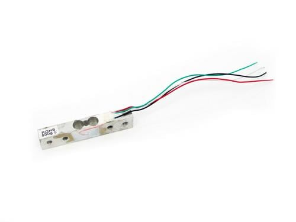

| Datasheet | Listing | Video |
| ------ | ------ | ------ |
|[link](https://media.digikey.com/pdf/Data%20Sheets/Seeed%20Technology/314990000_Web.pdf)        |[link](https://www.electromaker.io/shop/product/weight-sensor-load-cell-0-500g?gQT=1)        |       |

- AC/DC converter
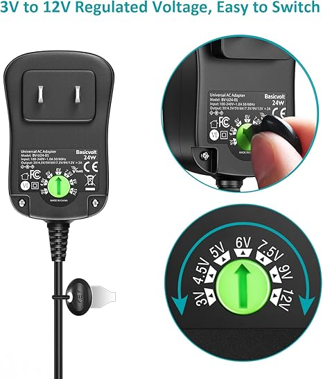

| Datasheet| Listing | Video |
| ------ | ------ | ------ |
|        |[link to listing](https://www.amazon.com/Basicvolt-Universal-Bluetooth-Household-Electronics/dp/B09J4GBWF5?source=ps-sl-shoppingads-lpcontext&ref_=fplfs&psc=1&smid=A1APYMMM12ELOR&gQT=1)       |       |

- Nichrome wire 
    - Nichrome wire has high electric resitance and high heat tolerance, so it effectivley converts electrical energy to heat. When electric current passes through the wire the high resistance cause the wire to release heat, and as the wire heats up, it begins to emit infrared radiation, which is felt as heat. Heres some [math related to heating up the wire](https://www.brysonics.com/heating-a-nichrome-wire-with-math/). Some other considerations to think about is that Nichrome wire should be kept dry when not in use and long term exposure to humidity leads to surface dulling.

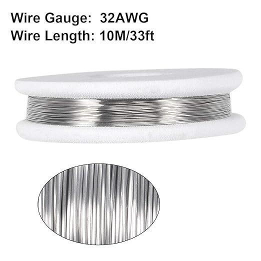

| Datasheet| Listing | Video |
| ------ | ------ | ------ |
|        |[link to listing](https://www.amazon.com/uxcell-Resistor-Nichrome-Resistance-Elements/dp/B07KC9Y8Z4?source=ps-sl-shoppingads-lpcontext&ref_=fplfs&psc=1&smid=A1THAZDOWP300U&gQT=1)       |       |

## 2-14-2025: Team contract and schedule next meetings 

Click to expand

Today we met to work on out team contract. I think the contract helped us lay out our expectations of how work flow will work, namely that we should all be involved in some extent with every part of the project, even when given individual task so that we can fully understand our project. We also planned to meet Moday 2-17-25 to begin preparing for our proposal review/ design review.

## 2-18-2025: Preparing for design review and attempting kicad

Click to expand

Due to a schedule conflict we weren't able to meet on the 17th so we
met today instead. We added consideration for heat in our project proposal and 
found that any effects that our heating system caused to our weight scenor that is 
also going to be in the box is not severe enough to cause major problems with our scenor.

After we did that we tried to begin the schematic in kicad but we were having problems findind footprints of sertain parts we wanted to use.
We did get a little bit more familar with the esp32. Useful pages for the esp in the datasheet: pg 10 pin layout, pgs 11-12 pin description.
Important to remember that pins 17 to 20 cant be used, 

## 2-19-2025: Design review

Click to expand

The only thing we were all available to do today was the 
the design reveiw. I think we did ok here are some considerations and/or 
changes will we think about that were brought up.

- Actual 2 factor authentication, since its pretty useless to.
have both keypad and fingerprint scanner for the owner to use but they only need 1
- Potentially changing our accuracy to about 90% from 80%.
- Adding user capabilities of controlling the temperature inside the box
since to take into account that users might order cold/ room temperature food.
- Better think of how to contol temperature so that that the box is not continuously heating up

## 2-20-2025: Post Design review changes and settling on parts + thinking about power regulation

Click to expand

Some changes we have decided to do were:

- Have the user be able to set a desired temperature for the box to be once food is inside
- Add a temperature senosr, which will report back to the esp, the 
esp will set a a range for the temperature inside the box to be in based on user input. The 
heating system will turn on and off based on where in the range the temperature of the box is.
- We are also considering taking out the fingerprint authentication and keeping only a master keypad code.
We figured that replacing the complexity of fingerprint for adding a temp sensor logic and user input to the esp.

After deciding on these changes we began looking for parts and how they would connect together (power, voltage, current wise).
To start we desided we need to change the AC/DC conver to get more power so we changed from 2 amp converter tp 5 amp converter.
Another thing we talked about is how we want to do voltage regulators.
We need: 

- 12 volts to go into the regulators from AC/DC converter.
- 3.3 volts for the esp, and keypad
- 5 volts for the weight sensor
- 12 volts for the heating system and lock
- ? temp sensor 

Then we need to consider how to step down the voltages because depending on how we do it can cause problems:
- Linear: Easier cirucit but the higher the voltage drop the hoter the circuit gets. So we cant use this for big drops from 12 to 3.3.
- Switch: good for big voltage drops but can cause noise that might interfere with the wifi of our esp
- So we are considering using the linear regulation and continuously step down the voltage.
Each regulator has a different part depending on the output voltage. We also dont know how to wire the regulator pieces
in terms od resistor and capacitors. 

## 2-21-2025: Settling on parts and Power system schematic 

Click to expand

Semi- slow day, heres what we did:

- Today we organized a [google doc](https://docs.google.com/document/d/1SWdd_iKvCoWNnZnPi8gho3ebCUdIYqPdJ7taNgwGFWw/edit?tab=t.0)
with pieces, datasheets, and listing of the parts we will use on it.

- Dhruva found that the datasheets for the the regulators have circuits for how to set up the chips (found in the doc).

- We decided to use one switching regualtor to go from 12 volts to 5 volts (which is needed for the weight sensor)
then set down the 5 volts to 3.3 volts using a linear converter. This way not much heat will be generated from 5 to 3.3 volts
and hopefully only one swithcing regulator placed far enough from the antenna of the esp the noise produced wont mess with our wifi.

- With this information we were able to finish the power system in kicad on Rohans computer, and he sent dhruva and i the schematic to have a copy. 

- We talked about how we would implement logic to turn on and and off the heating. bjts

## 2-25-2025 - 2-26-2025: Starting on Kicad schematic

Click to expand

2/25: 

- We didn't do much. We worked more on the PCB schematic and used ltspice to simulate our lock

- We used LT spice to simulate what how our lock circuit could be set up to all.The resulting cirucit and graph are shown below.
The cirucit uses a bjt to limit current to the lock selectively. The green line on the graph shows how when we send the signal to the bjt the current being 
flowing to 30mA then when we disconnected the signal to the bjt the current stopped flowing. Although 30mA isnt the exact Ampages we may want the behavior is what we want. 

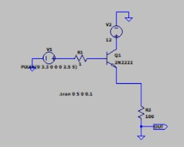
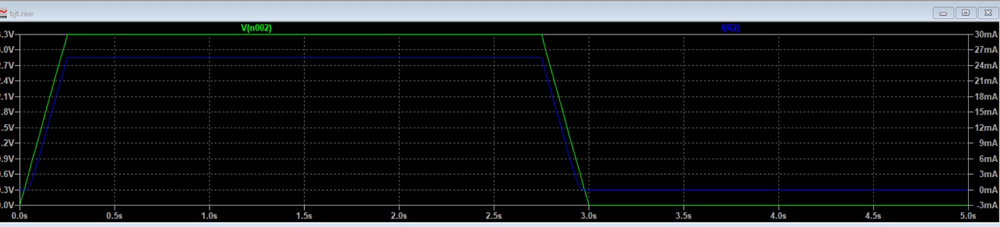
- We had our TA meeting and we showed our TA the start of our schematic. He told us we should keep traces in mind and that we should go to the the PCB design review on friday. I have to go home this week but my partners will attend

2/26: 

- We learned we needed to redo out esp schematic design becuase there are different esps and we were not using the right footprint fo the r one we wanted to use. 

- We are reconsidering heating because we dont know if we will have time to implement it and all the other component are more important to the functionality than heating. 

- We order some the lock and the temperature.

## 3-2-2025 - 3-8-2025: Design Doc, started work for Breadboard demo, got the lock and temp sensor to work on devboard

Click to expand

3/2: 

- Druva sent the PCB design and it passed audit. Also started the design doc.

3/5:

- We finished the Design doc.

3/6:

- We went to the ece shop and bought a dev board for the breadboard demo next week (picture of layout below).
The lock, and fingerprint sensor, the temperature sensor arrived. We tried to install ardino on all three of our computers
but it didnt work for Dhruva and me so we are going to use Rohans computer.
Once we got arduino to work we tested wifi through our devboard using gpio 5 and it worked.
Then we connected the temp sensor to one of the gpios and checked to check that it was working and reading accurately. 
At first it didnt read accurate but after ajusting the calibration factor a little we got more accurate readings. We werent 
sure if it worked at first so we took it outside while it was a little cold and windy and we saw reasonable decrease in temperature, but it too a little time.

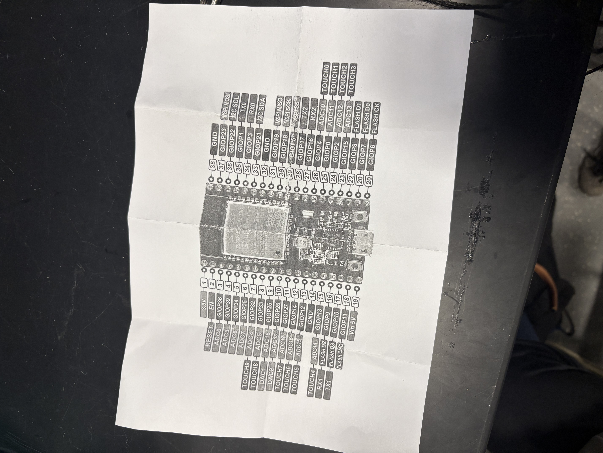

3/8: 

- Dhruva got his arduino to work and made the code for the website 

- We worked on the bjt ( [(tip120)](https://www.onsemi.com/pdf/datasheet/tip120-d.pdf), with [(current and voltage ratings)](https://www.st.com/content/ccc/resource/technical/document/datasheet/f9/ed/f5/44/26/b9/43/a4/CD00000911.pdf/files/CD00000911.pdf/jcr:content/translations/en.CD00000911.pdf)) lock cirucit with the devboard but we couldnt get it right reason.
So we used our own breadboard and played around with the circuit without the devboard and used 2 power sources in the lab for the 12v and 3.3v.
After changing resistors and trying to connect the the base, collector, and emmitor different ways we, with the help of another group who used a lock, drew the circuit on the 
whiteboard to make sure we were wiring it right (drawing below). After doing this and confirming which pins were the base, collector, and emmitor we finally got it to work.
After that we slowly transfered the circuit back to the original breadboad with the devboard and it worked. 

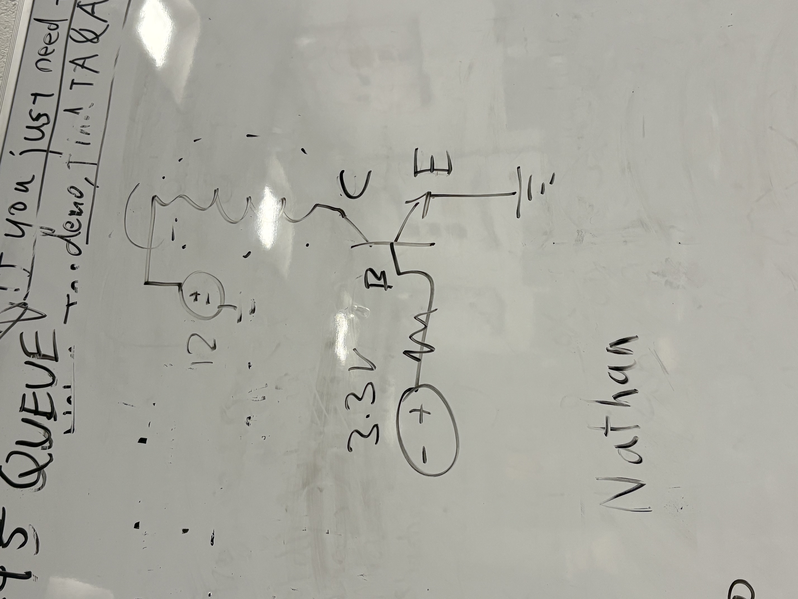

## 3-10-2025 - 3-12-2025: More breadboard demo prep, got the keypad to work on devboard, Demo, PCB order 2

Click to expand

3/10: 

- We tried to wire up the fingerprint sensor to the  devboard but
we couldn't connected it. We got it to light up so it was getting power from the esp but
for some reason it wasn't recognized by arduino. We kept trying it but we ended up breaking it by giving it too much voltage to the point where the lights wouldnt turn on again.
We then checked out a new fringerprint sensor from the lab but decided not test it before we figure out the problem.

- We tried to work on the weight sensor, but we were not getting a proper reading, we think it might be that the signal isnt beign amplified enough. We used the ina that came with the sensor but we might use the [hx711](https://cdn.sparkfun.com/datasheets/Sensors/ForceFlex/hx711_english.pdf) as the signal amplifier instead because there is more documentation using it. 

- Wired keypad with [matrix scanning](https://cdn.sparkfun.com/assets/7/e/f/6/f/sparkfun_keypad.pdf) to the devboard.
I worked rather consistantly but sometimes wires come loose.

3/11:

- Breadboard demo day. Really early. We showed them the box locks the keypad works and that we have a website. Asked about swithcing to a button on the website
instead of the fingerprint sensor but that would reduce complexity, so we either find another way or make the fingerprint sensor work.

3/12:

- Whole aday was spent on pcb design, We dont think the first pcb will work because of the traces might be wrong because we used auto router,
so this time we manually routed everything.

## 3-25-2025 - 3-28-2025: Tested the Nichrome heating and the voltage subsytem on pcb order 2, switched to RFID and got it to work on devboard

Click to expand

3/25:

- Both pcb order 1 and 2 came. We forgot to give the parts to the machine shop.

- We tried the different fingerprint scanner but we had the same problem.

- We tried the Nichrome wire on the breadboard with just the devboard and a resistor just to see if it would get hot and it did. 
We tried multiple different resistors.We then tried using the same ciruit setup as the lock with bjt so that we could selectively turn on heating but it would no loger heat up.

- We decided to try and replace fingerprint with RFID. We borrowed one from the lab. 

3/27:

- Dhruva took the rfid home and got it working.

- We began soldering parts to our second order to test the voltage requlator with the esp using the lab equipment.
We measured the voltages using the multimeter and the correct voltages were not being outputted so we know our order 2 power subsystem is wrong.

3/28:

- We tested all our current parts on the devboard gpios one last time to check the gpios that work for each component.

- We got the wrong weight sensor because its too small, so we ordered a new one.

## 3-30-2025 - 4-6-2025: Got Nichrome heating to work on devboard and worked with programing using the esp prog uart

Click to expand

3/30:

- sent the 2 PCBs files, 1 with the esp chip and one witht he devboard just in case we dont get voltage regulation to work.

4/1: 

- TA meeting today, we talked about changing to RFID instead of fingerprint.
We also grading for the final demo and we found out that its most important get the esp chip onto the board and be able to program it.
We also found out that it was ok to have tiny devboards like the hx711 or the ina for the weight sensor.

- We dropped off our paerts to the machine shop. 

- We tested the heater with the same setup as the lock again and it wasn't getting noticeable warmer.
We used the multimeter and saw rhat the wire wasn't getting 12V.

4/2:

- We went ot our TAs office hours and talked about potentially making 3 different PCBS.
1 main PCB witht the chip on it and spce for breakout boards, and 2 mini breakout boards for the ams and the hx711.
We will either make our own breakout boards or use the premade ones we have.
We looked for schematics of the breakout boards online so we could remake it in kidac to build our own.
heres oen that we found for the [hx711](https://cdn.sparkfun.com/assets/f/5/5/b/c/SparkFun_HX711_Load_Cell.pdf).

- After that we went to self ervice to get a bunch of bjts of different tips to test with our heater.
The first on we tested was the tip 120 (the same tip we were previously using) and it worked. Maybe we just fried our original tip 120.
We then tried heating with a duty cycle (for saftey reasons), but it wasnt getting nearly hot enough to feel any difference so we decided to not use a duty cycle and instead have a cut fo temperature.

4/3:

- We got the uart bridge and looked over pcb design. We bought jumper cables and plugged them into our devboard and tried to program it using the prog.
The website wasn't comming up at first but that was because we needed to download somedrivers we didnt know about.
Dhruva brought it home and it worked for the 32d esp ( the one his friend gvae him), but not the esp s3 ( the one we are using)

4/6:

- We found out our prog wasnt working because we neede to download linux because windows doenst have the drivers we needed.
We tested the buck converter we bought to take 12V to 5 ( or aboout 4.7).
We were able to power the esp with it so it works. We decided to change from usb to micro usb for programing.
We were having trouble programing using the uart. We got the green light on it to flash on the prog so it is sending stuff but the esp is not receiving it. 

 
## 4-7-2025 - 4-10-2025: Got progarming with the UART to work and waiting for PCB3

Click to expand

4/7:

- We asked a TA when order 3 should come and they said by wensday but today order 4 is due. We tested brograming using the uart again and 
this time we got both the blue and green lights flashing meaning that the esp ig getting what is being sent but it still doesnt work.
So we checked that 3.3v was going into the esp when we were progrmaing and it was, then we checked if the voltage across tx and rx and the are always high (3.3v),
then we checked if we had tx nd rx switched they werent, then we checked for
a short by checking the continuity and ther was no short. Then we tried to use other tr and rx pins on the esp and it still didn't work.
We will probably wate for the order to come in to try agian.

4/8:

- We had our TA meeting today. We got an email from the e-shop to come talk about our project but we couldnt make it so we will go tomorrow.
Dhruva got a new uart from his friend so were gonna try it out.
It worked on Rohans computer. We were able to get our program and wifi working.
The we decided to change our code so to a static IP instead of a dynamically allocated one because for final demo we
wont be able to look for it on the serial moniter. 
When we tried the static IP we could reach the website. So we tried setting one of the previous dynamically allocated IPs to the static IP and it worked. 
And our micro usb came.

4/9: 

- We went to the eshop to talk about our box design. We changed from putting the RFID and keypad
on the front of the box to on the top. Everything else is about the same. The PCB didnt come so we couldn't do anything else.

4/10: 

- PCB 3 still didnt come so we cant do anything.

## 4-14-2025 - 4-18-2025: Working on order 3 PCB, WIFI, RFID, and Keypad works on board

Click to expand

4/14:
- Pcb order 3 came and we picked up our box from the machine shop with the keypad and the RFID on the top.

- We started soldering connectors to test the traces, but then we tried to unsolder them to use the stencil. Instead we just used a new pcb.
We then used the stencil to put only the esp chip to the board then we hand soldered the 
to test the connection and test the uart bridge. 
We tried to program the esp for our website 
but we didnt have reception in the lab. The once we had reception it still didnt work because we had rx and tx switched.
Then it programed but the IPs didnt work. We tried to hold the wires out of potential keep out zones,
but it didnt work. Finally we tried a basic wifi test sketch and it worked.
Then we started setting up our power subsystem and authentication by soldering 
screw terminals for the keypad. Power subsystem was working but we couldnt test
the keypad becuase the screw terminal screws were too small for the screw driver.
We decided to keep our order 3 board for guaranteed 20 points.

4/15:

- We had to desolder the screw terminal we put on the board becuase we couldnt find a screwdriver for the screws, then we went 
to self service to get more connectors. We also bought some ribbon cnnectors and soldered them.

- We trie to test the RFID on the board but it wouldnt turn on. We thought maybe it wasn't getting enough power from the prog  or maybe the traces were wrong,
so we tried powering it with the lab equipment but it still didnt work. So then we took the RFID off the top of the box and used lab equipment and it turned on.
We then checked the voltage it was getting (came out to 3.2V), which should be enough. So then we checked that it was getting enough current
and it was drawing 100mA which is enough. So we continued wiring the RFID up so that it would send information and not just turn on.
We got a communication failure and we thought maybe the esp pins werent soldered well, so we checked the continuity but it was connected properly.
Then we changed the baud rate and it still didnt work, then we checked the wiring but it was right. The we checked the current through the esp and rfid and both got 100mA which should be enough.
We checked the sda pins and it was outputing 1.8V but we need 3.3V so this is the proble. We thought the problem might come from a short or poor soldrering.
So we resoldered and checked for continuity problems but everything was good. We tried new code, still didnt work.

- TA meeting: We asked some questions, right now with PCB3 we have at least 20 points by our TAs standards.

- We tried the RDIF on the devboard and checked the voltage (2.8V). Then we noticed that some of the pins were wrong in the code
we fixed the code, retried it  on the pcb and it worked. Another problem it could have been was that the pcb was sitting on metal.
We screwed it back to the box and it worked. Next we soldered the keypad wires to the pcb, then tested it and it worked. Officially the whole authentication subsystem works.
tomorrow if pcb4 doesnt come we will work on the temp sensor.

4/18:

- PCB 4 might not come so we will try to do as much as we can with order 3. All thats left is weight, lock, temp, heating.

- We soldered on resistors, bjts, and screw terminals, elongated wires for weight sensor, tested power with barrel jack.
We attached the buck to to the 12V anc checked the output ( it was 4.7V), connected the AMS and it did output 3.3V as intended.
We tested the lock, and at first it wasnt getting power but then it worked.

- Only temp sensor hearing and weight sensor left.

## 4-21-2025 - 4-27-2025: We got all the subsystem to work on the PCB4 for our final project and prepared for the Final Demo

Click to expand

4/21:

-  Order 4 came. We went to self service and got more connectors, screw terminals, and bjts.
We soldered all the surface mount components( capacitors, resistors, esp) using the oven. We had a little trouble with the stencil but get fixed it .
Then we hand soldered the ams, bjts then tried programing. We had tx and rx wires flipped but then we fixed it.
Then we wired up the buck and the 12V source to check that the esp would get 3.3V and it did so the power subsystem works.
Then we wired up the keybpad, and after fixing some wiring it worked. The we wired the RFID and it worked.

- We decided to oder a new capstone heating that would be less finicky to work with and safer thsan a live wire of Nichrome.

4/22:

- We soldered the weight sensor wires and set up the temp sensor. It worked but we had to be careful that none of the wires touched so we taped them.
We wired up the lock and it worked.

- For demo we showed the temp sensor, lock, Keypad, and website.

4/23:

- We got some holes drilled into our box for wires to go through. Then we tested the weight sensor, solder and used jumpers for the hx711
for the weight sensor. It programmed but the readings were off. We tested for continuity of the wires we solfered to the weight sensor wires,
changed the code, then it worked so now Box Mechanism subsytem works. We added code to our main code for RFID and wired up. We tried
the weight sensor, temp sensor, lock, RFIED, and keypad all together and they worked.

4/24:

- The new Capton heater came so we wired it up and it worked, so now all of heating subsystem works but the temp sensor only reports about a .2C change evey 30 sec.
The full box works! We contemplated using 2 capstones to make it hotter faster but decided against it for saftey reasons.

- Started working on documents for the final demo

4/25:

- Ran through our presnetaions, split up part, and put our final touches on the documentation. The final Demo is tomorrow

